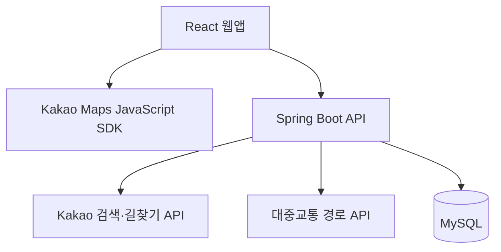

<div align="center">

<h1>만나역</h1>

<p><strong>어디서 만날지 고민될 때, 함께 만나기 좋은 역.</strong></p>

<p>여러 사람의 출발지를 바탕으로 이동 부담과 주변 상권을 비교해<br>약속역과 주변 장소를 추천하는 웹 서비스입니다.</p>

<p>
  <a href="https://mannayeok.kr"><strong>서비스 바로가기 ↗</strong></a>
  &nbsp;·&nbsp;
  <a href="#주요-기능">주요 기능</a>
  &nbsp;·&nbsp;
  <a href="#서비스-구조">서비스 구조</a>
  &nbsp;·&nbsp;
  <a href="#문제-해결과-구현">문제 해결과 구현</a>
  &nbsp;·&nbsp;
  <a href="#실행과-검증">실행과 검증</a>
</p>

<p><code>Java 17</code> &nbsp; <code>Spring Boot</code> &nbsp; <code>MySQL</code> &nbsp; <code>React</code></p>

</div>

---

## 프로젝트 소개

지도상의 중간 지점이 모두에게 편한 약속 장소는 아닙니다. 이동 시간과 환승 부담이 다르고, 역 주변에 만날 장소가 부족할 수도 있습니다.

만나역은 **2~4명의 출발지**를 입력받아 이동 시간·환승·노선 접근성·주변 상권을 함께 평가합니다. **만남 적합도와 이동 공평성**을 나누어 추천하고, 사용자가 후보역과 주변 장소를 비교할 수 있도록 구성했습니다.

| 구분 | 내용 |
| --- | --- |
| 개발 기간 | 2026.05 ~ 현재 |
| 개발 형태 | 개인 프로젝트 · 1인 개발 |
| 담당 범위 | 추천 로직·철도 데이터 가공, 프런트엔드·백엔드 개발, API 연동 및 배포 |

## 주요 기능

| 기능 | 내용 |
| --- | --- |
| 출발지 검색 | 2~4명의 출발지를 검색하고 지도에서 위치 확인 |
| 약속역 추천 | 대표 추천역·대안 후보 최대 3개·이동 공평성 기준 추천역 제공 |
| 이동 정보 비교 | 출발지별 이동 정보와 대중교통 경로 확인 |
| 주변 장소 탐색 | 추천역 주변 카페·음식점·술집·놀거리 검색 |
| 결과 공유 | 추천 결과를 링크로 공유 |
| 추천 저장 | 로그인 후 추천 결과 저장 및 메모 관리 |

## 서비스 구조



| 영역 | 담당 역할 |
| --- | --- |
| **프런트엔드** | 출발지 입력과 지도 표시, 추천 후보 선정·점수 계산, 이동 정보·장소 비교 |
| **백엔드** | 외부 API 프록시, 요청 검증·캐시·호출 제한, 회원·인증 및 추천 저장 |
| **데이터베이스** | 회원·저장 데이터 관리, Flyway 기반 스키마 변경 관리 |

### 기술 구성

| 영역 | 사용 기술 |
| --- | --- |
| 백엔드 | Java 17, Spring Boot 3.5, WebFlux / WebClient |
| 데이터 저장 | MySQL, Spring Data JPA, Flyway |
| 인증 | Spring Security, JWT, BCrypt |
| 프런트엔드 | React 19, Vite 8, Tailwind CSS 4 |
| 외부 연동 | Kakao Maps JavaScript SDK, Kakao Local API, Kakao 길찾기 API, 대중교통 경로 API |
| 테스트·관측 | Node.js Test Runner, JUnit, Reactor Test, Actuator / Micrometer |

## 문제 해결과 구현

### 01. 이동 부담과 장소 편의성을 함께 반영하는 추천

**문제**

지리적 중간 지점만으로는 참여자별 이동 부담과 약속 장소의 실용성을 반영하기 어려웠습니다.

**구현**

이동 시간·환승·노선 접근성·상권 정보를 반영해 후보역을 평가하고, **만남 적합도와 이동 공평성 점수를 각각 산정**합니다. 추천 후보 선정과 점수 계산은 프런트엔드에서 수행합니다.

**결과**

대표 추천역과 대안 후보 최대 3개를 제공하고, 이동 공평성 기준 추천역도 별도로 제시해 사용자가 목적에 맞는 후보를 비교할 수 있도록 했습니다.

**관련 코드** · [추천 점수 산정](frontend/src/services/meetingRecommender.js) · [추천 결과 화면 구성](frontend/src/App.jsx)

---

### 02. 조회 범위 제한과 캐시를 통한 외부 API 요청 최적화

**문제**

후보역마다 상권을 조회하거나 동일 조건을 반복 검색하면 외부 API 중복 호출이 발생합니다.

**구현**

상세 상권 조회 대상을 **최대 12개 역**으로 제한하고, 브라우저와 서버에서 조회 결과를 재사용합니다.

| 적용 위치 | 캐시 대상 | 유지 시간 |
| --- | --- | --- |
| 브라우저 `localStorage` | 역별 상권 집계 데이터 | **7일** |
| 서버 메모리 | 동일 조건의 Kakao 로컬 검색 성공 응답 | **10분** |

<details>
<summary>상세 조회 후보 선정 방식</summary>

만남 적합도 5개, 이동 공평성 3개, 상권 3개, 노선 접근성 1개 순서로 선정합니다. 중복 역을 제외하고 부족한 수는 후순위 후보로 보충하며, 전체 상한은 12개입니다.

</details>

**검증**

동일 조건의 로컬 검색을 **2회 요청했을 때 외부 호출이 1회 발생하는지** 확인하는 자동 테스트를 작성했습니다.

외부 응답을 모의한 캐시 재사용 검증이며, 운영 환경의 응답 시간 개선율을 측정한 결과는 아닙니다.

**관련 코드** · [후보 선정·브라우저 캐시](frontend/src/services/kakaoApi.js) · [서버 캐시](backend/src/main/java/com/mannayeok/backend/kakao/service/KakaoApiService.java) · [캐시 테스트](backend/src/test/java/com/mannayeok/backend/kakao/service/KakaoApiServiceTest.java)

---

### 03. REST API 키 분리와 서버 요청 제어

**문제**

REST API 키가 프런트엔드 번들에 포함되어 노출될 위험이 있었고, 외부 API로 전달할 요청의 범위와 호출량을 제어해야 했습니다.

**구현**

Spring Boot 프록시에서 REST API 인증을 처리하도록 분리했습니다. 검색 유형·파라미터·값의 범위를 검증하고, 프록시 요청에 IP별 호출 제한을 적용합니다.

| 처리 항목 | 적용 방식 |
| --- | --- |
| REST API 인증 | 서버에서 키를 관리하고 외부 요청에 인증 정보 추가 |
| 요청 검증 | 허용된 검색 유형·파라미터와 값의 범위 확인 |
| 프록시 호출 제한 | 기본 설정 기준 **IP별 60초당 120회** |
| 한도 초과 응답 | **HTTP 429** 및 `Retry-After` 반환 |

**결과**

유효하지 않은 검색 요청과 호출 한도를 초과한 요청을 외부 API 전달 전에 차단합니다.

지도 SDK용 JavaScript 키는 프런트엔드에서 사용합니다. 호출 제한은 서버 인스턴스 메모리 기준으로 집계하며, 한도는 환경 설정으로 변경할 수 있습니다.

**관련 코드** · [검색 요청 검증](backend/src/main/java/com/mannayeok/backend/kakao/service/KakaoLocalRequestValidator.java) · [IP별 호출 제한](backend/src/main/java/com/mannayeok/backend/config/ApiRateLimitWebFilter.java) · [호출 제한 테스트](backend/src/test/java/com/mannayeok/backend/config/ApiRateLimitWebFilterTest.java)

## 코드 탐색

| 경로 | 주요 내용 |
| --- | --- |
| [`frontend/src/components/`](frontend/src/components/) | 화면 컴포넌트 |
| [`frontend/src/services/`](frontend/src/services/) | 추천 로직과 API 연동 |
| [`frontend/src/data/`](frontend/src/data/) | 역·노선·상권 데이터 |
| [`frontend/tests/`](frontend/tests/) | 추천 회귀 테스트 |
| [`backend/src/main/java/`](backend/src/main/java/) | API·인증·외부 서비스 연동 |
| [`backend/src/main/resources/`](backend/src/main/resources/) | 설정 및 DB 마이그레이션 |
| [`backend/src/test/java/`](backend/src/test/java/) | 백엔드 테스트 |

## 실행과 검증

저장소 루트에서 시작합니다. Node.js·npm, JDK 17, MySQL이 필요하며 프런트엔드와 백엔드를 각각 실행합니다. 아래 실행 예시는 PowerShell 기준입니다.

<details>
<summary><strong>1. 백엔드 실행</strong></summary>

MySQL 데이터베이스와 계정을 준비한 뒤 로컬 설정 파일을 복사합니다.

```powershell
cd backend
Copy-Item application-local.properties.example application-local.properties
```

복사한 파일에 DB 접속 정보, JWT 비밀값, 사용할 외부 API 키를 설정합니다.

```powershell
.\gradlew.bat bootRun
```

`bootRun`은 이 로컬 설정 파일을 자동으로 읽습니다. 기본 포트는 `8080`입니다.

macOS/Linux에서는 `cp application-local.properties.example application-local.properties`로 파일을 복사·설정한 뒤 `./gradlew bootRun`을 실행합니다.

선택 기능의 설정과 API 예시는 [백엔드 문서](backend/README.md)를 참고하세요.

</details>

<details>
<summary><strong>2. 프런트엔드 실행</strong></summary>

저장소 루트의 별도 터미널에서 실행합니다.

```powershell
cd frontend
npm install
```

`frontend/.env.local` 파일을 만들고 아래 설정과 Kakao **JavaScript 키**를 입력합니다.

```env
VITE_KAKAO_MAP_KEY=발급받은_JavaScript_키
VITE_BACKEND_API_URL=
VITE_AUTH_API_BASE_URL=http://localhost:8080
```

```bash
npm run dev
```

터미널에 표시되는 주소로 접속합니다. macOS/Linux에서도 동일한 npm 명령을 사용합니다.

로컬 개발에서 `VITE_BACKEND_API_URL`을 비우면 `/api/kakao`와 `/api/transit` 요청은 Vite 프록시를 통해 기본 `http://localhost:8080`으로 전달됩니다. 인증 API 주소는 `VITE_AUTH_API_BASE_URL`로 설정합니다.

</details>

<details>
<summary><strong>3. 테스트와 빌드</strong></summary>

**프런트엔드** — `frontend` 디렉터리에서 실행합니다.

```bash
npm run test:regression
npm run lint
npm run build
```

추천 회귀 테스트는 고정된 외부 API 응답을 사용해 후보역 순서, 점수, 이동 정보, 주변 장소 결과의 변경을 확인합니다.

**백엔드** — `backend` 디렉터리에서 실행합니다.

```powershell
.\gradlew.bat test
```

macOS/Linux에서는 `./gradlew test`를 실행합니다. 캐시 재사용, 요청 제한 등 서버 동작을 검증합니다.

</details>

외부 API 요청 횟수와 소요 시간을 기록하는 코드는 [ExternalApiMetrics](backend/src/main/java/com/mannayeok/backend/observability/ExternalApiMetrics.java)에서 확인할 수 있습니다.
