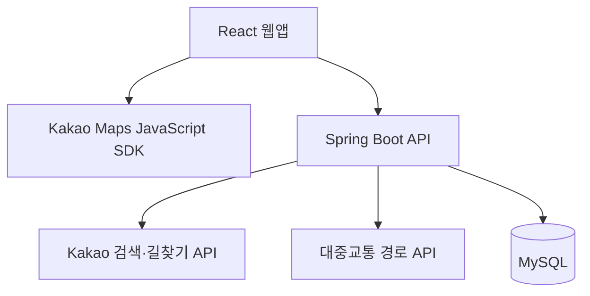

<div align="center">

<h1>만나역</h1>

<p><strong>어디서 만날지 고민될 때, 함께 만나기 좋은 역.</strong></p>

<p>
여러 사람의 출발지를 바탕으로 이동 부담과 주변 상권을 비교해<br>
약속역과 주변 장소를 추천하는 웹 서비스입니다.
</p>

<p>
  <a href="https://mannayeok.kr"><strong>서비스 바로가기 ↗</strong></a>
  &nbsp;·&nbsp;
  <a href="#주요-기능">주요 기능</a>
  &nbsp;·&nbsp;
  <a href="#기술-스택">기술 스택</a>
  &nbsp;·&nbsp;
  <a href="#서비스-구조">서비스 구조</a>
  &nbsp;·&nbsp;
  <a href="#로컬-실행">로컬 실행</a>
</p>

<br>

<p>
  
</p>

<p>
Java · Spring Boot · MySQL · React · Vite · Tailwind CSS
</p>

</div>

---

## 프로젝트 소개

친구들과 약속을 잡을 때, 지도상의 중간 지점이 모두에게 편한 장소는 아닙니다. 이동 시간과 환승 부담이 다르고, 역 주변에 만날 장소가 부족할 수도 있습니다.

만나역은 **2~4명의 출발지**를 입력받아 이동 시간·환승·노선 접근성·주변 상권을 함께 고려합니다.

**만나기 좋은 역**과 **이동 공평성 기준의 역**을 구분해 추천하며, 대안 후보와 출발지별 이동 정보를 비교할 수 있습니다. 추천역 주변의 카페·음식점 등을 탐색하고, 결과를 공유하거나 저장할 수 있습니다.

## 주요 기능

| 기능 | 설명 |
| --- | --- |
| **출발지 검색** | 2~4명의 출발지를 검색하고 지도에서 위치 확인 |
| **약속역 추천** | 이동 부담과 주변 상권을 반영한 대표 추천역 및 대안 후보 최대 3개 제공 |
| **공평성 비교** | 참여자 간 이동 부담의 균형을 고려한 추천역 별도 제공 |
| **이동 경로 확인** | 출발지별 이동 정보와 대중교통 경로 확인 |
| **주변 장소 탐색** | 추천역 주변 카페·음식점·술집·놀거리 검색 |
| **결과 공유** | 추천 결과를 링크로 공유 |
| **추천 저장** | 로그인 후 추천 결과 저장 및 메모 관리 |

### 사용 흐름

1. 참여자의 출발지를 입력합니다.
2. 대표 추천역, 공평성 기준 추천역, 대안 후보를 비교합니다.
3. 추천역까지의 이동 경로와 주변 장소를 확인합니다.
4. 추천 결과를 공유하거나 저장합니다.

## 기술 스택

## 기술 스택

### Backend

<p>
  
  
  
  
</p>

Spring WebFlux / WebClient · Spring Data JPA · Flyway · JWT · BCrypt · Spring Mail

### Frontend

<p>
  
  
  
  
</p>

React 19 · Vite 8 · Tailwind CSS 4 · HTML/CSS · Framer Motion · Lucide React

### Tools & Testing

<p>
  
  
  
</p>

JUnit · Reactor Test · Node.js Test Runner · Spring Boot Actuator · Micrometer

### External APIs

Kakao Maps JavaScript SDK · Kakao Local API · Kakao 길찾기 API · 대중교통 경로 API
## 서비스 구조



| 구성 | 역할 |
| --- | --- |
| **React 웹앱** | 출발지 입력, 지도 표시, 추천 후보 선정·점수 계산, 이동 정보·주변 장소 표시 |
| **Spring Boot API** | 외부 API 연동, 요청 검증·캐시·호출 제한, 회원·인증·추천 저장 |
| **MySQL** | 회원 및 저장 데이터 관리 |

추천 후보 선정과 점수 계산은 프런트엔드에서 수행합니다. 백엔드는 외부 API 요청을 중계하고, 인증과 데이터 저장 기능을 제공합니다.

## 주요 동작 방식

### 약속역 추천

출발지와 철도 데이터를 바탕으로 후보역을 구성하고, 이동 시간·환승·노선 접근성·주변 상권을 반영해 평가합니다.

| 평가 기준 | 설명 |
| --- | --- |
| **만남 적합도** | 이동 부담과 주변 상권 등을 함께 고려한 약속 장소의 적합성 |
| **이동 공평성** | 참여자 간 이동 부담의 균형 |

두 기준을 바탕으로 대표 추천역, 대안 후보 최대 3개, 공평성 기준 추천역을 제공합니다.

[추천 로직 확인](frontend/src/services/meetingRecommender.js)

### 상권 조회와 캐시

상세 상권 조회 대상은 **최대 12개 역**으로 제한합니다. 반복 조회 시 브라우저와 서버에 저장한 데이터를 재사용합니다.

| 적용 위치 | 저장 대상 | 유지 시간 |
| --- | --- | --- |
| 브라우저 `localStorage` | 역별 상권 집계 데이터 | 7일 |
| 서버 메모리 | 동일 조건의 Kakao 로컬 검색 성공 응답 | 10분 |

<details>
<summary>상세 조회 후보 선정 기준</summary>

만남 적합도 5개, 이동 공평성 3개, 상권 3개, 노선 접근성 1개 순서로 선정합니다.

중복 역을 제외하고 부족한 수는 후순위 후보로 보충하며, 전체 조회 대상은 최대 12개입니다.

</details>

[후보 선정·브라우저 캐시](frontend/src/services/kakaoApi.js) · [서버 캐시](backend/src/main/java/com/mannayeok/backend/kakao/service/KakaoApiService.java)

### 외부 API 요청 처리

Kakao REST API 키는 서버에서 관리하고, Spring Boot 프록시를 통해 외부 API를 호출합니다. 지도 표시를 위한 JavaScript 키는 프런트엔드에서 사용합니다.

| 항목 | 처리 방식 |
| --- | --- |
| 요청 검증 | 허용된 검색 유형·파라미터 및 값의 범위 확인 |
| 프록시 호출 제한 | 기본 설정 기준 IP별 60초당 120회 |
| 한도 초과 응답 | HTTP 429 및 `Retry-After` 반환 |

호출 제한은 서버 인스턴스 메모리 기준으로 집계하며, 한도는 환경 설정으로 변경할 수 있습니다.

[검색 요청 검증](backend/src/main/java/com/mannayeok/backend/kakao/service/KakaoLocalRequestValidator.java) · [호출 제한](backend/src/main/java/com/mannayeok/backend/config/ApiRateLimitWebFilter.java)

## 프로젝트 구성

| 경로 | 내용 |
| --- | --- |
| [`frontend/src/components/`](frontend/src/components/) | 화면 컴포넌트 |
| [`frontend/src/services/`](frontend/src/services/) | 추천 로직 및 API 연동 |
| [`frontend/src/data/`](frontend/src/data/) | 역·노선·상권 데이터 |
| [`frontend/tests/`](frontend/tests/) | 추천 회귀 테스트 |
| [`backend/src/main/java/`](backend/src/main/java/) | API·인증·외부 서비스 연동 |
| [`backend/src/main/resources/`](backend/src/main/resources/) | 서버 설정 및 DB 마이그레이션 |
| [`backend/src/test/java/`](backend/src/test/java/) | 백엔드 테스트 |

## 로컬 실행

Node.js·npm, JDK 17, MySQL이 필요합니다.

저장소 루트에서 시작하며, 프런트엔드와 백엔드를 각각 실행합니다. 아래 명령은 PowerShell 기준입니다.

### 1. 백엔드

MySQL 데이터베이스와 계정을 준비한 뒤 로컬 설정 파일을 복사합니다.

```powershell
cd backend
Copy-Item application-local.properties.example application-local.properties
```

복사한 파일에 DB 접속 정보, JWT 비밀값, 사용할 외부 API 키를 설정합니다.

```powershell
.\gradlew.bat bootRun
```

- 기본 포트: `8080`
- `bootRun` 실행 시 로컬 설정 파일을 자동으로 읽습니다.
- 추가 설정과 API 예시는 [백엔드 문서](backend/README.md)를 참고하세요.

<details>
<summary>macOS / Linux 실행 명령</summary>

```bash
cd backend
cp application-local.properties.example application-local.properties
```

설정 파일을 수정한 뒤 실행합니다.

```bash
./gradlew bootRun
```

</details>

### 2. 프런트엔드

저장소 루트의 별도 터미널에서 실행합니다.

```bash
cd frontend
npm install
```

`frontend/.env.local` 파일을 만들고 아래 설정을 입력합니다.

```env
VITE_KAKAO_MAP_KEY=발급받은_JavaScript_키
VITE_BACKEND_API_URL=
VITE_AUTH_API_BASE_URL=http://localhost:8080
```

```bash
npm run dev
```

터미널에 표시되는 주소로 접속합니다.

로컬 개발에서 `VITE_BACKEND_API_URL`을 비우면 `/api/kakao`와 `/api/transit` 요청은 Vite 프록시를 통해 기본 `http://localhost:8080`으로 전달됩니다. 인증 API 주소는 `VITE_AUTH_API_BASE_URL`로 설정합니다.

## 테스트와 빌드

### 프런트엔드

`frontend` 디렉터리에서 실행합니다.

```bash
npm run test:regression
npm run lint
npm run build
```

추천 회귀 테스트는 고정된 외부 API 응답을 사용해 후보역 순서, 점수, 이동 정보, 주변 장소 결과의 변경을 확인합니다.

### 백엔드

`backend` 디렉터리에서 실행합니다.

```powershell
.\gradlew.bat test
```

macOS/Linux에서는 `./gradlew test`를 실행합니다.

| 테스트 | 확인 내용 |
| --- | --- |
| [캐시 테스트](backend/src/test/java/com/mannayeok/backend/kakao/service/KakaoApiServiceTest.java) | 동일 조건 검색 2회에 외부 호출이 1회 발생하는지 확인 |
| [호출 제한 테스트](backend/src/test/java/com/mannayeok/backend/config/ApiRateLimitWebFilterTest.java) | 요청 제한 필터의 동작 확인 |

캐시 테스트는 외부 응답을 모의한 동작 검증입니다.

외부 API 요청 횟수와 소요 시간 기록은 [ExternalApiMetrics](backend/src/main/java/com/mannayeok/backend/observability/ExternalApiMetrics.java)에서 확인할 수 있습니다.
